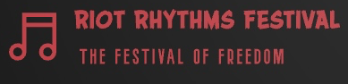

## Riot Rythm Festival 2024
Welcome to this freedom of music.
This is where you will have your best time in 2024

### [Introduction](#introduction)

- Introduction to the festival, its purpose, and what attendees can expect.
--------------------------------------------------------------------------
### [Am I Responsive](#am-i-responsive)

- Discussion on the website's responsiveness and its adaptation to various devices. We will illustrate this responsiveness with an image showing how the website adjusts to different screen sizes.
----------------------------------------------------------------------------
### [UX](#ux)

- Detailed walkthrough of the design process and the strategies used to maximize user satisfaction.
----------------------------------------------------------------------------
  ## [The Strategy](#the-strategy)
----------------------------------------------------------------------------
- Describes the overarching goals for the UX design and how these goals meet user needs.

  - [The Scope](#the-scope)

    Defines what the project will include and what will be left out, focusing on features and content.

  - [The Structure](#the-structure)

    Describes how information is organized on the site and how different sections are logically connected.

  - [The Skeleton](#the-skeleton)

    Presents wireframes and base layouts that illustrate the structure of the user interface.

  - [The Surface](#the-surface)

    Explains design choices like typography, color scheme, and other visual elements
- [Project Overview](#project-overview)
  - [Learning Objectives](#learning-objectives)
  - [Assignment Requirements](#assignment-requirements)
  - [Self-Assessment](#self-assessment)
- [User Experience](#user-experience)
  - [Site goal](#site-goal)
  - [Kanbanboard](#kanban)
- [Features](#features)
- [Technologies](#technologies)
  - [Language](#language)
  - [Tools](#tools)
  - [Frameworks & Libaries](#frameworks-libaries)
  - [Design](#design)
- [Data Modeling and Datbase Design](#database)
  - [ERD](#erd)
  - [API Integration](#api-integration)
- [Testing](#testing)
  - [Bugs](#bugs)
- [Set Up Project](#set-up-project)
  - [Create Repository](#create-repository)
  - [Intalize in VS Code](#intalize-in-vscode)
  - [Set Up Virtual Environments](#setup-virtual)
  - [Create Django Project](#create-django-project)
- [Deployment](#deployment)
  - [Deployment To Github](#deployment-to-github)
  - [Deployment to Heroku](#heroku-deployment)
  - [Local Deployment](#local-deployment)
- [Credit](#credit)
  - [Content](#credit-content)
  - [Images](#images)
  - [Thank You](#thank-you)